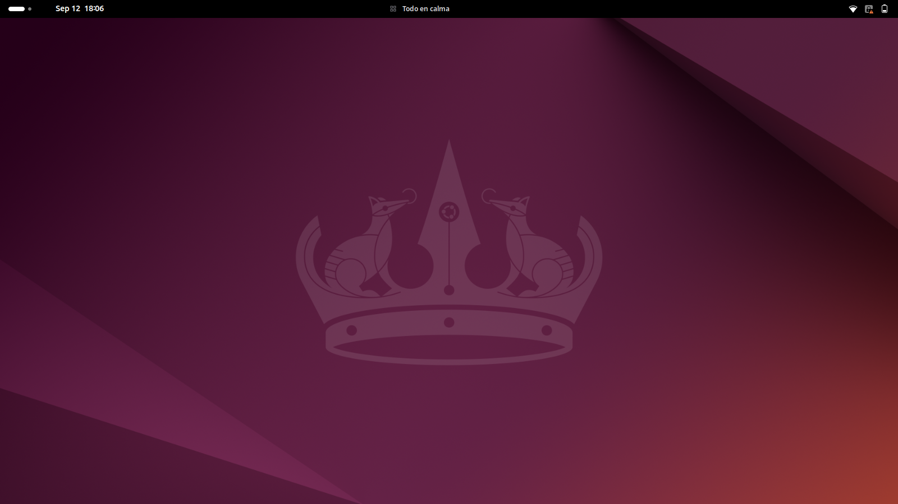
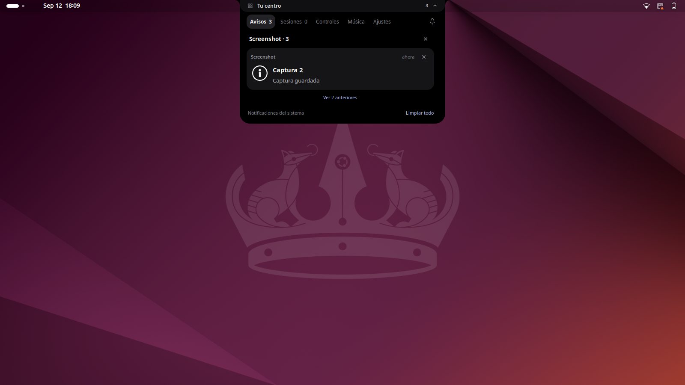
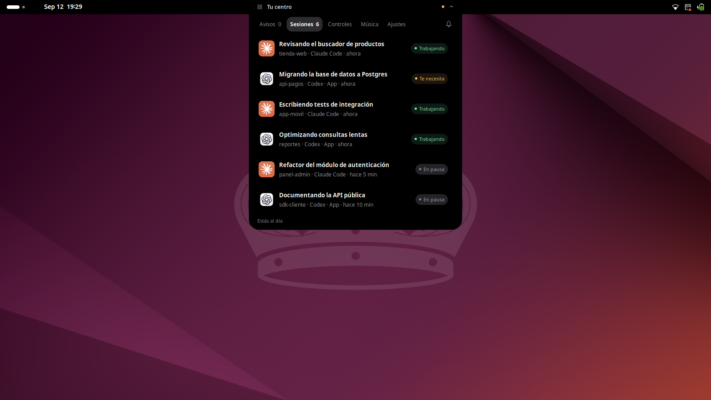
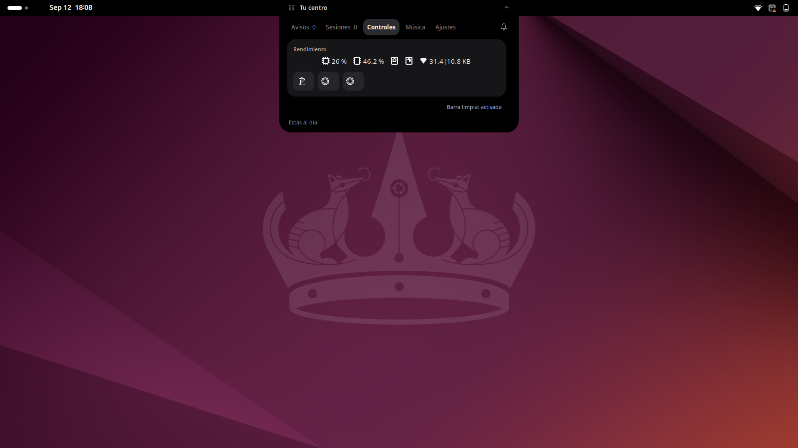
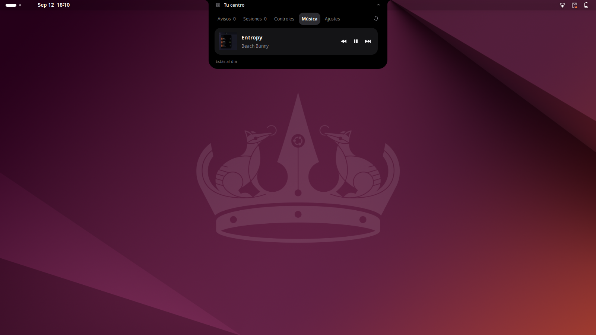
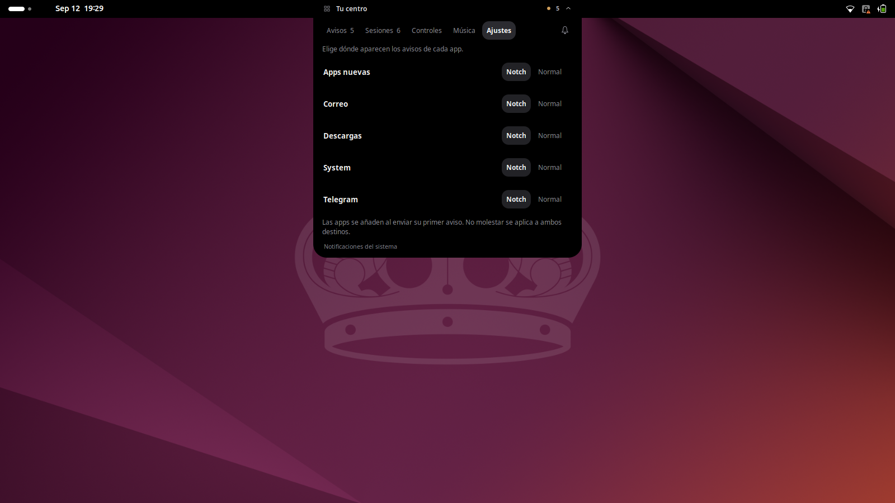
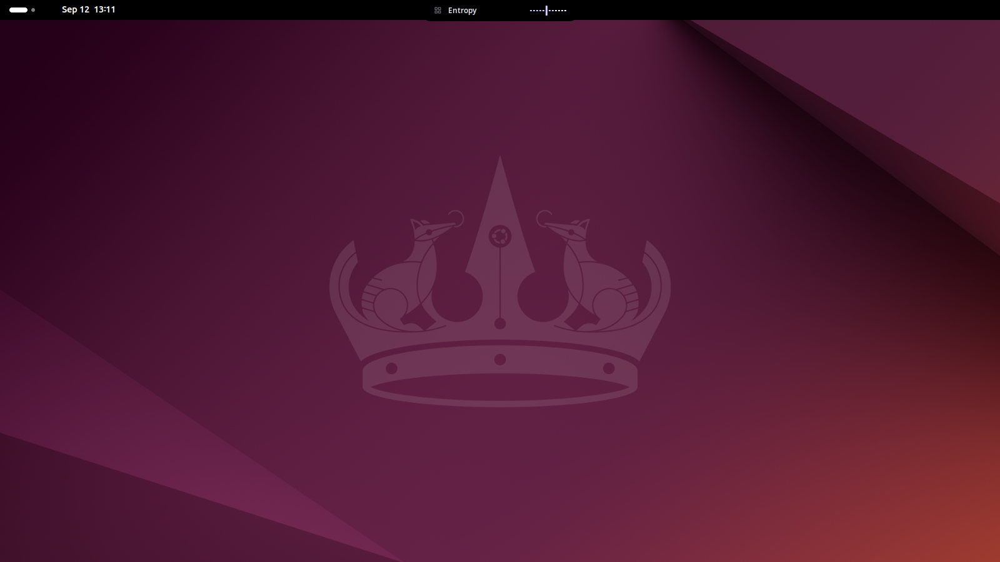

# Agent Island

*[Español](README.es.md)*

A black, top-edge notch for GNOME Shell 46, with animated previews and a compact desktop hub.



- **Notifications:** normal previews last 2.5 seconds, pause on hover, and history groups notices by application with expandable originals. Replace native banners with notch previews, retain original actions and dismissal, and select **Notch** or **Normal** per app in **Ajustes**. New apps appear after their first notification. GNOME still controls Do Not Disturb, urgency and application permissions. History follows GNOME notification lifetime; it is not an archive.
- **Sessions:** real Codex Desktop tasks and terminal agents used in the last 30 minutes, plus verified working/waiting sessions. Opening a context renews its visibility; archived history stays out of the notch. Desktop tasks open through their exact `codex://threads/<id>` URI. Terminal sessions use process identity and the existing exact terminal/tmux navigation.
- **Controls:** native system and extension indicators move into **Controles**, including a compact app-icon grid, resource monitor and clipboard when installed. Battery, Wi-Fi and sound remain at the top right. **Barra limpia** restores the original panel arrangement. Recording/sharing, accessibility and keyboard indicators remain in the panel.
- **Media:** a dedicated Música section contains MPRIS artwork, track information, previous/play/next and a twelve-band spectrum driven by actual playback audio, with fast attack and smooth release. It reads the playback monitor only while the spectrum is visible, keeps no audio files, and stops when the player closes.

The closed notch matches the panel height, leaving application tabs unobstructed. The clock moves left. Opening the notch takes focus; automatic previews do not. Click outside or press Escape to close. Disabling restores the clock, controls and native notification presentation.

## Screenshots

| Avisos | Sesiones |
|---|---|
|  |  |

| Controles | Música |
|---|---|
|  |  |

| Ajustes | Pill with the spectrum |
|---|---|
|  |  |

## Session data

Terminal hooks atomically write JSON to `$XDG_RUNTIME_DIR/agent-island/`, watched through `Gio.FileMonitor`. A 15-second process check removes dead agents. Unverified legacy files are hidden until a current hook event supplies process identity. See [the protocol](docs/protocol.md).

Codex Desktop uses a Python child process owned by the extension, a read-only SQLite task catalog and the local desktop IPC stream. Only task metadata reaches the Shell. Active status comes from runtime events, never from file modification times. Unavailable live status is labeled **Reciente**; a disconnect clears stale active states. Duplicate desktop/terminal task IDs are merged.

The desktop IPC is an internal interface verified against the installed Codex Desktop 26.909. Unknown versions fall back to recent tasks instead of guessing activity. This integration may require maintenance after Codex upgrades. The extension does not install a background service.

## Install on Ubuntu

Tested on Ubuntu 24.04 (GNOME Shell 46, Wayland). Python 3, `glib-compile-schemas` and the audio stack ship with the desktop; only `git` and `jq` usually need installing:

```bash
sudo apt install git jq
git clone https://github.com/jmjm1558/agent-island.git
cd agent-island
./install.sh --claude --codex   # flags are optional and idempotent
```

The spectrum bars in the Música tab are optional and need one more package for the FFT (`libpulse-simple.so.0` already ships with Ubuntu's audio stack):

```bash
sudo apt install libfftw3-single3
```

Without it the bars just stay flat; nothing else in the extension depends on it. For Fedora, Arch and other distros, see [Other distros](#other-distros) below.

- `./install.sh` symlinks the extension into `~/.local/share/gnome-shell/extensions/`.
- `--claude` registers the hooks in `~/.claude/settings.json` (backup kept).
- `--codex` registers the hooks in `~/.codex/hooks.json` (backup kept).
  Codex requires a one-time approval: run `/hooks` inside codex and trust them.

On **Wayland** a newly installed extension only loads after you **log out and
back in**. Then:

```bash
gnome-extensions enable agent-island@jmjm1558.github.io
```

### Uninstall

```bash
gnome-extensions disable agent-island@jmjm1558.github.io
rm ~/.local/share/gnome-shell/extensions/agent-island@jmjm1558.github.io
```

Then remove the `agent-island-hook.sh` entries from `~/.claude/settings.json`
and `~/.codex/hooks.json` (or restore the `.bak` backups the installer made).

## Other distros

Nothing here is Ubuntu-specific: the extension is plain GJS against the
standard GNOME Shell API, the hooks are POSIX shell plus `jq`, and the two
Python helpers use only the standard library plus two runtime libraries
loaded with `ctypes`. `jq`, `python3`, `glib-compile-schemas` and
`gnome-extensions` ship with any distro's GNOME desktop group, and
`install.sh` needs no sudo and touches only `$HOME`. Two things do not
travel automatically, though:

- **GNOME Shell version.** `extension/metadata.json` declares
  `"shell-version": ["46"]`; Shell refuses to load an extension outside its
  declared major version. Fedora 40 and openSUSE Tumbleweed ship 46
  alongside Ubuntu 24.04, but a rolling distro that has since moved past it
  needs its running version added to that array — and the panel/notification
  internals this extension reaches into (`Main.panel.statusArea`,
  `Main.layoutManager.addTopChrome`, message-tray banners) have changed
  enough between Shell releases before that adding the version number only
  gets it to load, not proof it still behaves.
- **The spectrum's two `ctypes` libraries.** `libpulse.so.0` /
  `libpulse-simple.so.0` ship with any PulseAudio or PipeWire-with-pulse-shim
  install (i.e. essentially any GNOME desktop), but `libfftw3f.so.3` is not
  preinstalled anywhere and needs an explicit package: `libfftw3-single3` on
  Debian/Ubuntu, `fftw-libs-single` on Fedora, `fftw` on Arch (ships every
  precision in one package). Missing either just leaves the spectrum bars
  flat; nothing else in the extension depends on them.

Two things are intentionally not portable, on any distro: the Codex bridge
(`codex_bridge.py`) reads a specific Codex Desktop SQLite schema and IPC
protocol version (`STREAM_VERSION = 11`, pinned to Codex Desktop 26.909) and
falls back to "Reciente" on any other version rather than guessing activity;
and `extension/spectrum.js` launches its helper at the literal path
`/usr/bin/python3`, which is absent on non-FHS setups (e.g. NixOS) even when
`python3` resolves fine on `$PATH`.

## Development and verification

```bash
python3 dev/run-tests.py
python3 dev/test-codex-bridge.py
python3 dev/test-controls.py
python3 dev/test-spectrum.py
python3 dev/test-layout.py
```

The UI suite starts a disposable GNOME compositor with its own D-Bus, runtime, settings and extensions. It exercises actual pointer clicks and notification D-Bus actions. Portals and input-method helpers are excluded. Screenshots and logs go to ignored `dev/artifacts/`. `--interactive` keeps that private compositor alive for inspection.

The controls suite also loads the installed resource monitor and clipboard code with private settings, and checks process liveness. The spectrum suite sends test audio through a temporary silent sink on the actual sound server and verifies the notch response, silence and cleanup. It removes the sink afterward without changing the default device.

The bridge suite covers SQLite filtering, IPC snapshots and patches, approval state, unsupported protocols and disconnect recovery. It uses a local fixture server. Real desktop stream status was also checked during development; final interaction with the user's installed extensions requires loading the new JavaScript in their desktop session.

On Wayland, log out and back in to load modified extension JavaScript. Toggling the extension alone does not reliably reload imported modules.

## Layout

- `extension/island.js`, `stylesheet.css`: notch and views.
- `extension/controls.js`: reversible native indicator relocation.
- `extension/notifications.js`, `schemas/`: routing and persisted preferences.
- `extension/sessions.js`, `codex_bridge.py`: verified terminal processes and desktop tasks.
- `extension/media.js`: MPRIS integration.
- `extension/spectrum.js`, `audio_spectrum.py`: playback-monitor FFT and smooth bar updates.
- `hooks/agent-island-hook.sh`: shared terminal hook adapter.
- `dev/`: isolated UI and bridge tests.

## License

GPL-2.0-or-later. See [LICENSE](LICENSE).
