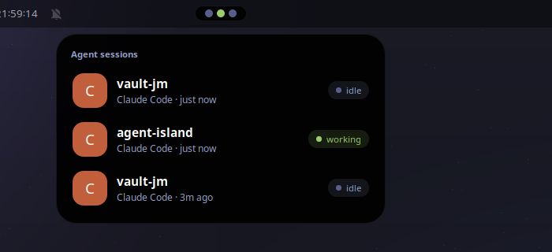
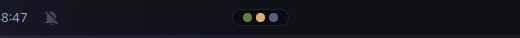

# Agent Island

A **Dynamic Island for GNOME Shell**: a pill in the middle of the top bar
(where the clock used to be) showing, in real time, every AI coding agent
session running on your machine — Claude Code and Codex today. Click it and
it unfolds into an iPhone-style card.



Collapsed, it is one dot per session, colored by state:



| Color | State | Meaning |
|-------|-------|---------|
| 🟢 green (pulsing) | `working` | the agent is doing things |
| 🟠 amber | `waiting` | **the agent needs you** (permission, input) |
| ⚪ gray | `idle` | finished, waiting for your next prompt |

The expanded card is a notch hub, not just an agent list:

- **Jump to session**: click an agent row to focus its terminal. Sessions
  managed by tmux select the exact pane; detached aoe sessions open a
  terminal already attached to the right session.
- **Now playing** (MPRIS: Spotify, browsers, mpv...): cover art, track info
  and prev/play/next controls above the sessions; the pill shows a small
  note while something plays. If you run another music pill extension you
  will see music twice; disable one.
- **Notifications**: the most recent desktop notifications (Telegram,
  WhatsApp/YouTube/mail via their apps or browser) below the sessions, with
  app icon, message preview and age; click one to open it. The pill shows
  an amber count while any are present. The island only mirrors the Shell's
  message tray - it never swallows or dismisses anything.

The clock is moved to the left side of the bar so the island can live in the
center. Disabling the extension puts everything back.

## How it works

No polling, no Agent Island daemon, no custom socket. Three small pieces:

```
Claude Code ──┐  lifecycle hooks        ┌────────────────────────────┐
              ├──── write one JSON ────▶│ $XDG_RUNTIME_DIR/agent-    │
Codex ────────┘  file per session       │ island/<agent>-<id>.json   │
                                        └─────────────┬──────────────┘
                                                      │ inotify (Gio.FileMonitor)
                                        ┌─────────────▼──────────────┐
                                        │ GNOME Shell extension:     │
                                        │ pill + expandable card     │
                                        └────────────────────────────┘
```

- Both Claude Code and Codex expose **lifecycle hooks** with the same JSON
  schema. A shared shell adapter ([hooks/agent-island-hook.sh](hooks/agent-island-hook.sh))
  maps hook events to a session state, captures a terminal PID or exact tmux
  target when available, and writes the result atomically to a tmpfs file.
- The extension watches that directory with a file monitor, so state changes
  are pushed to the UI. Zero CPU cost while nothing happens. Clicking a row
  uses the captured target, with window-title matching only as a compatibility
  fallback for older state files.
- The state dir lives in `$XDG_RUNTIME_DIR` (memory-backed, per-user, wiped
  on logout), so dead sessions cannot survive a reboot.

Any other agent can join by writing the same file format — see
[docs/protocol.md](docs/protocol.md).

## Install

Requirements: GNOME Shell 45/46 (developed on Ubuntu 24.04, Wayland), `jq`.

```bash
git clone https://github.com/jmjm1558/agent-island.git
cd agent-island
./install.sh --claude --codex   # flags are optional and idempotent
```

- `./install.sh` symlinks the extension into `~/.local/share/gnome-shell/extensions/`.
- `--claude` registers the hooks in `~/.claude/settings.json` (backup kept).
- `--codex` registers the hooks in `~/.codex/hooks.json` (backup kept).
  Codex requires a one-time approval: run `/hooks` inside codex and trust them.

On **Wayland** a newly installed extension only loads after you **log out and
back in**. Then:

```bash
gnome-extensions enable agent-island@jmjm1558.github.io
```

### Uninstall

```bash
gnome-extensions disable agent-island@jmjm1558.github.io
rm ~/.local/share/gnome-shell/extensions/agent-island@jmjm1558.github.io
```

Then remove the `agent-island-hook.sh` entries from `~/.claude/settings.json`
and `~/.codex/hooks.json` (or restore the `.bak` backups the installer made).

## Development

You do not need to log out to hack on this. Run a disposable nested shell:

```bash
./dev/run-nested.sh
```

It opens a window with a full GNOME Shell (your real config and extensions,
private D-Bus) with Agent Island enabled. Useful extras:

- `AGENT_ISLAND_AUTOEXPAND=1 ./dev/run-nested.sh` — the island expands by
  itself after 1.5 s (you cannot script clicks inside a nested compositor).
- `gjs -m dev/screenshot.js out.png` — run *inside* the nested session to
  capture evidence screenshots (see the file for the D-Bus trick it uses).
- Fake a session without any agent:

  ```bash
  D=$XDG_RUNTIME_DIR/agent-island; mkdir -p $D
  printf '{"agent":"claude-code","state":"waiting","cwd":"%s","ts":%s}' \
      "$PWD" "$(date +%s)" > $D/claude-code-fake.json   # island updates live
  rm $D/claude-code-fake.json                            # and shrinks back
  ```

### Project layout

```
extension/            the GNOME Shell extension (what gets symlinked)
  extension.js        entry point: enable/disable + clock relocation
  sessions.js         SessionStore: watches the state dir, no polling
  media.js            MediaWatcher: MPRIS players via the Shell's own wrapper
  notifications.js    NotificationWatcher: mirrors the Shell's message tray
  island.js           the pill + the expandable card
  stylesheet.css      all the looks (iPhone-style black, big radii)
hooks/
  agent-island-hook.sh    shared Claude Code / Codex adapter (stdin JSON -> state file)
  claude-code.hooks.json  hook registration snippet for ~/.claude/settings.json
  codex.hooks.json        hook registration snippet for ~/.codex/hooks.json
dev/                  nested-shell test harness
docs/                 protocol spec + screenshots
install.sh            symlink + optional hook registration (idempotent)
```

## Roadmap

- [x] Media module in the expanded card (MPRIS: art, title, controls)
- [x] Notification peek: recent notifications inside the card
- [x] Click-to-session navigation, including exact tmux pane selection
- [ ] Live-activity chips inline in the pill (e.g. "needs input" text, not
      just a dot)
- [ ] More agents (Gemini CLI, Aider) — contributions welcome, it is one
      JSON file (see [docs/protocol.md](docs/protocol.md))
- [ ] Preferences UI (position, which modules, stale timeout)
- [ ] Submission to extensions.gnome.org

## License

GPL-2.0-or-later (see [LICENSE](LICENSE)). GNOME Shell is GPL-2.0-or-later
and extensions.gnome.org requires extensions to be distributed under
compatible terms, so forks must keep this license.
